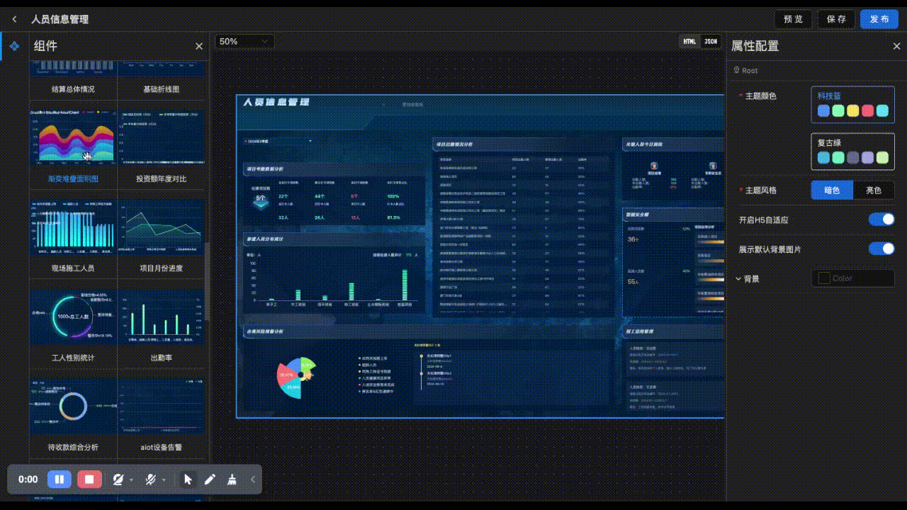
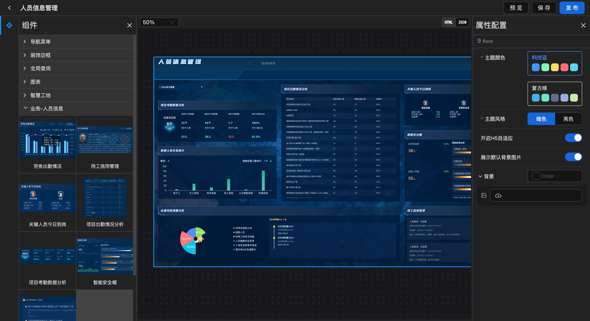
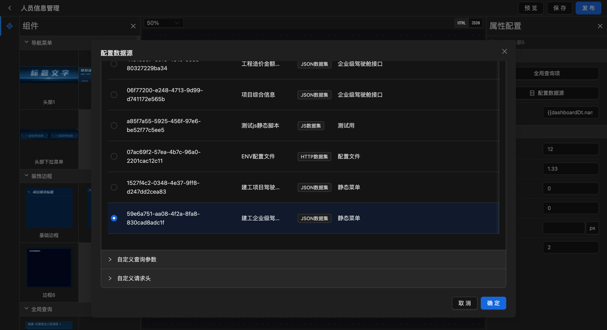
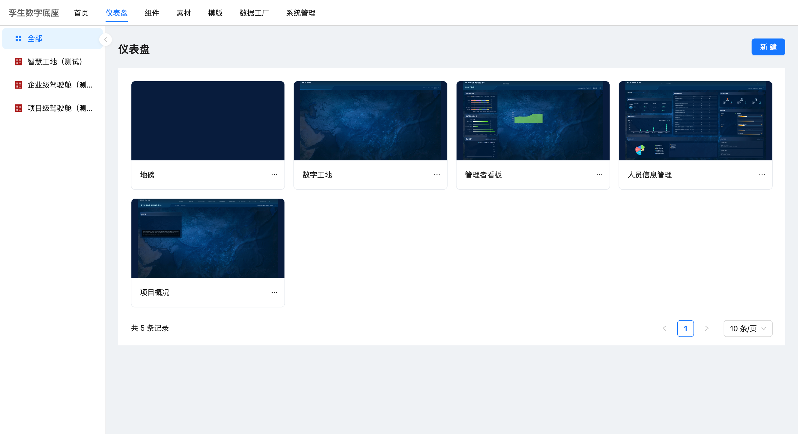
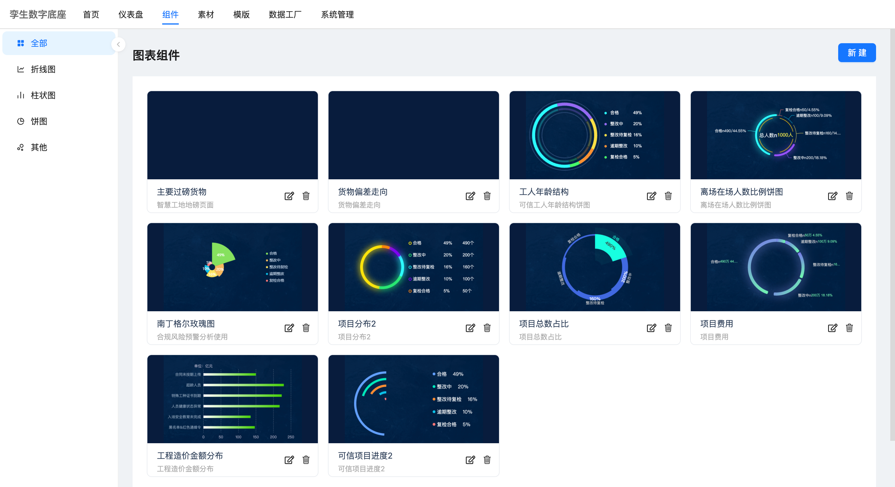
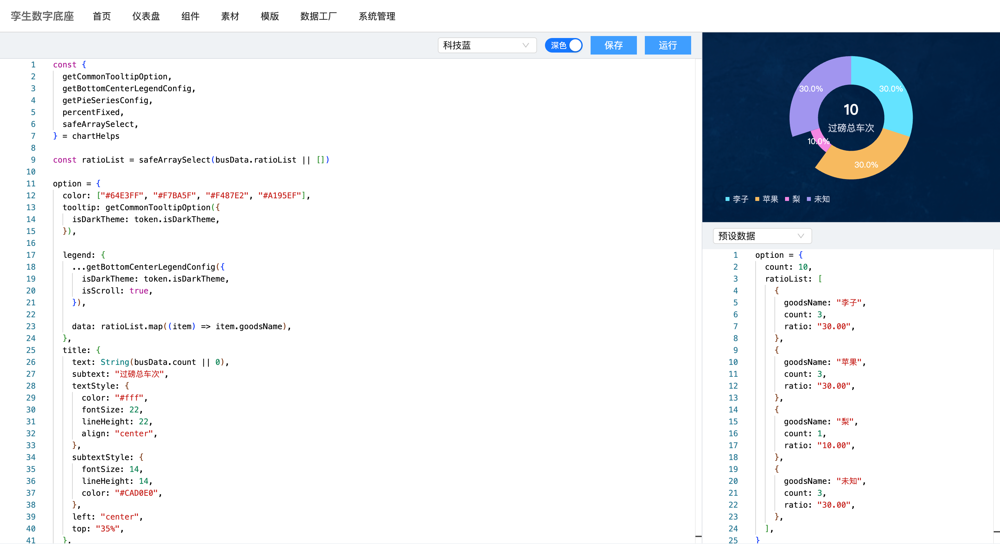
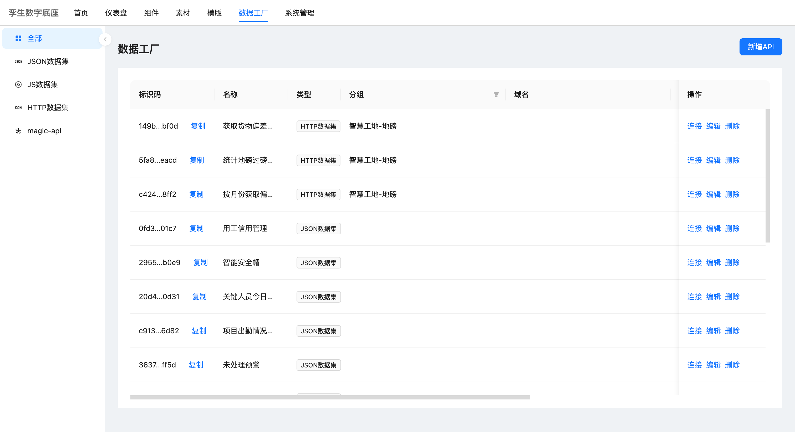
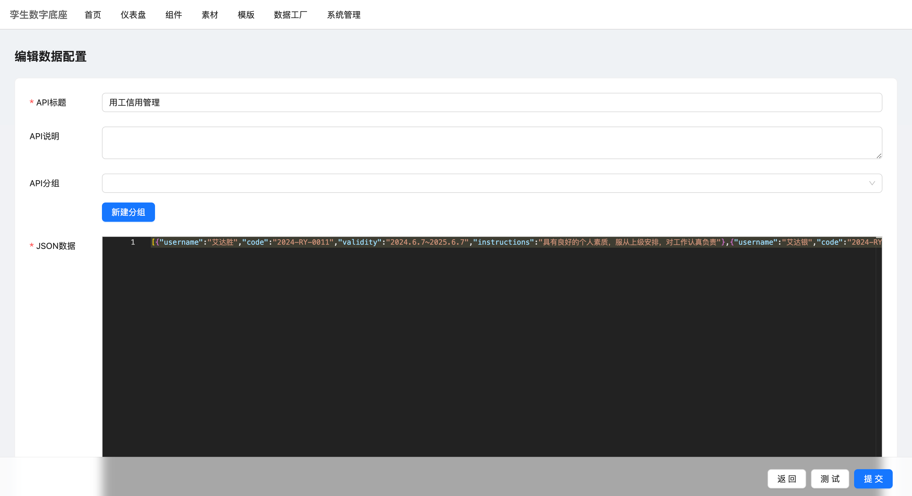
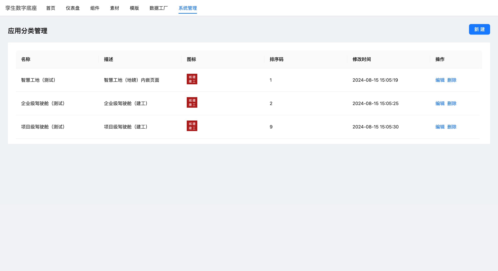

# 可视化大屏低代码

## 预览地址待部署

### TODO

- 设计器 ✅
- 自定义图表配置 ✅
- 接口配置 ✅
- 自定义组件
- 后端动态APi(方案未确定)

### 优化内容

- 自定义图表配置页面优化
- 接口配置页面优化

### 截图预览

- 设计器界面

  

- 组件属性配置

  

- 报表列表

  

- 自定义图表列表
  

- 编辑自定义图表
  

- 接口列表

  

- http接口定义
  

- json静态接口定义
  

- 应用分组列表

  

  ### 后端项目

  https://github.com/qqjay2017/dashboard-lowcode-api
